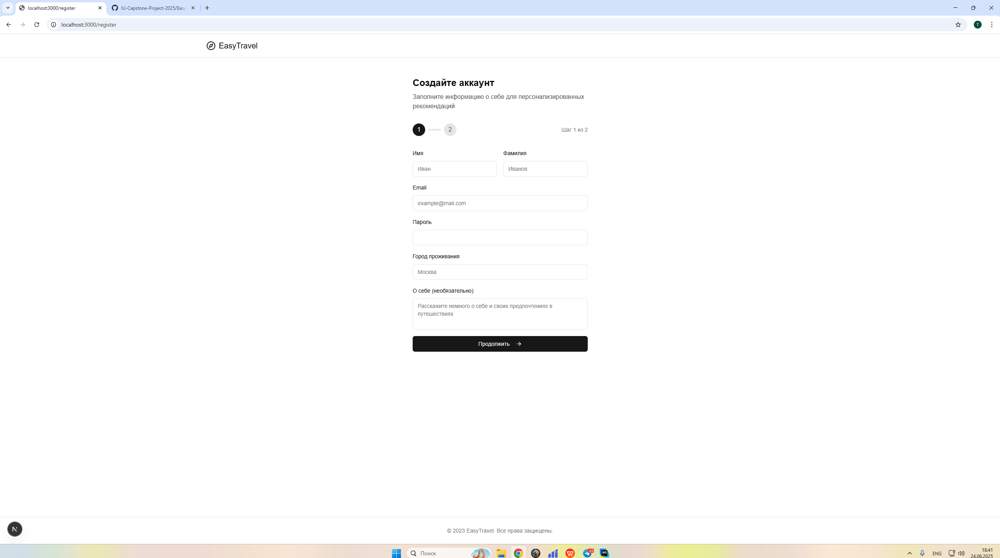
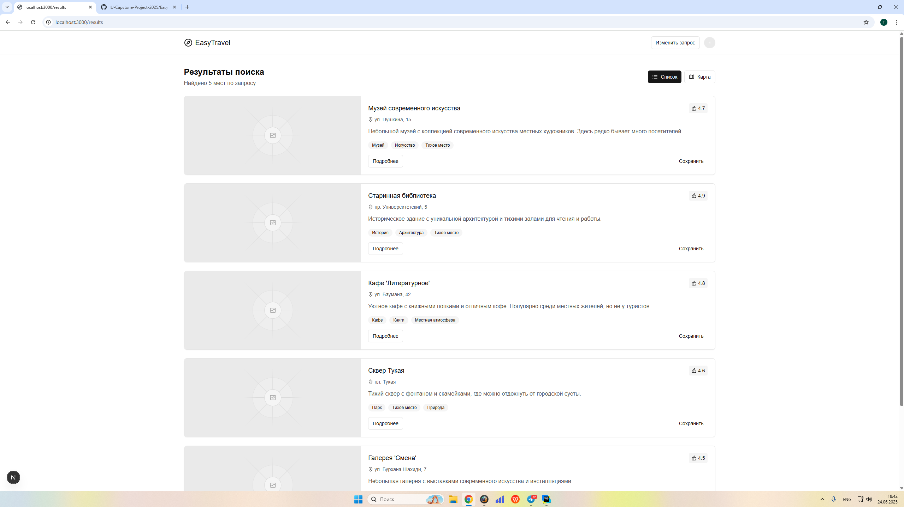
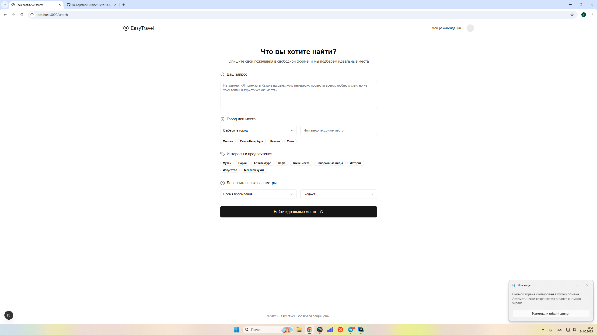

# **Week #3**

## Implemented MVP features

The following MVP features have been implemented to date:

### Data Engineering & ML:

* Collected the initial POI dataset (approximately 50,000 items).
* Completed full data cleaning and preliminary processing.
* Implemented a pipeline for enriching POI textual descriptions using the LLM model (Qwen2.5-3B-Instruct).
* Currently, over 35,000 items have been successfully processed and enriched (70% of the total dataset).

### Backend:

* Implemented service endpoints for user registration and authorization (JWT auth).
* Remaining key endpoints for search functionality are currently represented by placeholders.

### Frontend:

* The interface is fully prepared (React/Next.js + Tailwind UI).
* Frontend is ready for integration with the operational API.

## Demonstration of the working MVP

### Data Enrichment Examples:

| Original Description        | Enriched Description                                                                                                                                                                                                                                                                  |
| --------------------------- | ------------------------------------------------------------------------------------------------------------------------------------------------------------------------------------------------------------------------------------------------------------------------------------- |
| KGMA Library. Type: library | The KGMA Library is a cozy and calm place, ideal for students and researchers. Here you will find an extensive selection of educational and scientific materials, comfortable reading and working areas, and friendly staff ready to assist you in selecting the necessary literature.|

## ML

**Link to the training code**: *will be provided later after completing enrichment of the entire dataset.*

The **Qwen2.5-3B-Instruct** model was used to enrich POI descriptions, adding atmospheric details and recommendations while maintaining factual accuracy. Generation parameters:

* Max new tokens: 160
* Batch size: 8
* Device: CUDA (A100 GPU)

**Links to the initial model artifacts**: [Qwen2.5-3B-Instruct](https://huggingface.co/Qwen/Qwen2.5-3B-Instruct)

## Internal demo

* Demonstrated examples of data enrichment.
* Showed interface awaiting API integration.
* Discussed next steps and priorities for the upcoming week (completion of data processing and initiation of API integration).

# Weekly commitments

## Individual contribution of each participant

### Emil Goryachih

 - Implemented backend endpoints for user registration and JWT authentication.
 - Participated in data pipeline development and DLS tasks.
 - Contributed to the overall data enrichment strategy.

### Vladislav Galkin

 - Fully developed frontend interface using React/Next.js and Tailwind UI.
 - Prepared frontend for smooth API integration.
 - Ensured UI consistency and readiness for functional testing.
   https://github.com/IU-Capstone-Project-2025/EasyTravel/commit/e278a5eba8cebfb60893deeb49c5bce91d4ec134

## Plan for Next Week

* Complete dataset enrichment.
* Implement and test key search endpoints on the backend.
* Integrate backend API with frontend.

## Confirmation of the code's operability

We confirm that the code in the main branch:

* [ ] Is in working condition.
* [ ] Runs via docker-compose (or another alternative described in the `README.md`).
